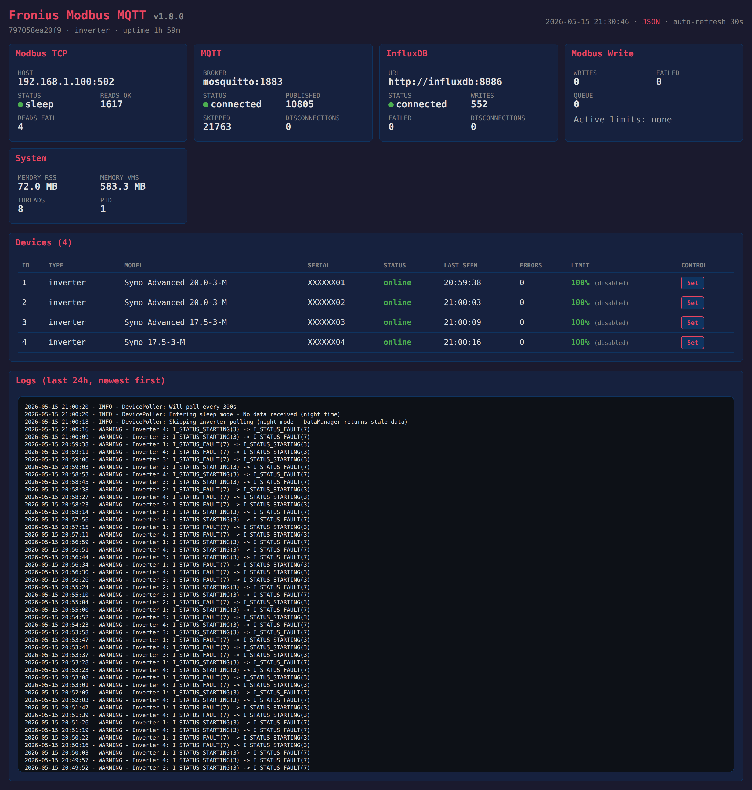
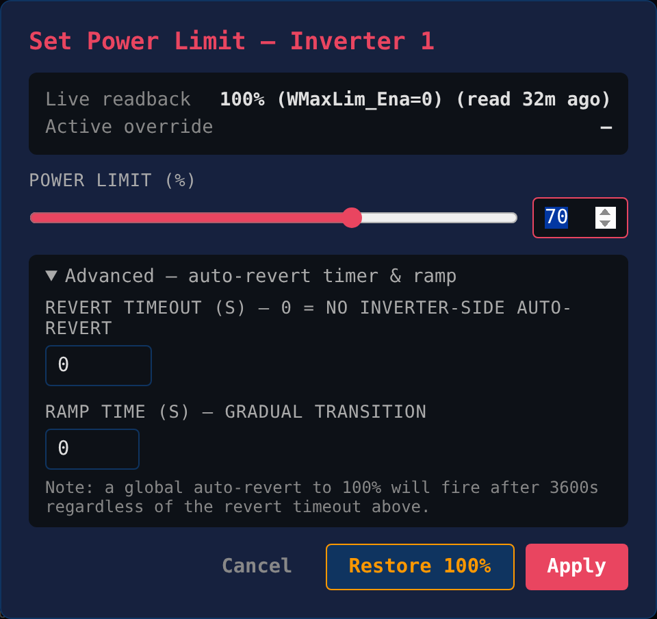

# Fronius Modbus MQTT

[](CHANGELOG.md)
[](LICENSE)

Python application that reads data from Fronius inverters and smart meters via Modbus TCP and publishes to MQTT and/or InfluxDB.

## Features

- **SunSpec Protocol Support** - Full SunSpec Modbus implementation with automatic scale factor handling
- **Multi-Device Support** - Poll multiple inverters and smart meters simultaneously
- **Home Assistant Integration** - MQTT autodiscovery for automatic entity creation
- **Runtime Monitoring** - Per-device online/offline status, read error counters, uptime tracking
- **MPPT Data** - Per-string voltage, current, and power (Model 160)
- **Power Limit Control** - Write inverter power limits with 11-step safety protocol — issue commands from the dashboard modal, via MQTT, or via the HTTP API ([reference](docs/POWER_LIMIT_CONTROL.md))
- **Immediate Controls** - Read inverter control settings (Model 123)
- **Event Parsing** - Decode Fronius event flags with human-readable descriptions
- **Data Validation** - Automatic detection and reconciliation of DataManager buffer corruption using MPPT as ground truth
- **Night Mode** - Automatic sleep detection when inverters go offline at night
- **Night Inverter Skip** - Skip inverter polling during night hours (DataManager returns stale data from sleeping inverters)
- **Connection Resilience** - Persistent reconnection monitoring, proactive health checks, data loss prevention
- **Diagnostic Debug System** - Configurable logging for register values, scale factors, status transitions, and corruption events
- **Security Hardened** - Non-root container, optional TLS/SSL, secret masking in logs
- **Monitoring Dashboard** - Built-in HTTP server with dark-theme HTML dashboard, JSON API and per-inverter control modal ([reference](docs/MONITORING.md))
- **Publish Modes** - Publish on change or publish all values
- **Docker Support** - Separate containers for inverters and meters
- **MQTT Integration** - Publish to any MQTT broker with configurable topics and LWT
- **InfluxDB Integration** - Time-series database storage with batching and rate limiting

## Quick Start

> Two paths: **A.** Pull the pre-built image from GHCR (recommended — fastest, multi-arch amd64+arm64). **B.** Clone and build locally (for developers / forks).

### Path A — pre-built image (recommended)

The image is published on every release tag to GitHub Container Registry:

```
ghcr.io/sm26449/fronius-modbus-mqtt:1.8.0
ghcr.io/sm26449/fronius-modbus-mqtt:1.8
ghcr.io/sm26449/fronius-modbus-mqtt:latest
```

Minimal `docker-compose.yml`:

```yaml
services:
  fronius-inverters:
    image: ghcr.io/sm26449/fronius-modbus-mqtt:1.8.0
    container_name: fronius-inverters
    restart: unless-stopped
    environment:
      - MODBUS_HOST=192.168.1.100         # Fronius DataManager IP
      - DEVICES_INVERTERS=1,2,3,4         # Comma-separated inverter Modbus IDs
      - MQTT_ENABLED=true
      - MQTT_BROKER=mosquitto              # MQTT broker hostname/IP
      - INFLUXDB_ENABLED=false             # Set true and configure if you want InfluxDB
      - MONITORING_ENABLED=true
    ports:
      - "8082:8080"                        # Monitoring dashboard
    volumes:
      - ./storage/inverters/config:/app/config
      - ./storage/inverters/logs:/app/logs
      - ./storage/inverters/data:/app/data

  fronius-meter:
    image: ghcr.io/sm26449/fronius-modbus-mqtt:1.8.0
    container_name: fronius-meter
    restart: unless-stopped
    environment:
      - MODBUS_HOST=192.168.1.100
      - DEVICES_METERS=240                 # Smart-meter Modbus IDs
      - MQTT_ENABLED=true
      - MQTT_BROKER=mosquitto
      - MONITORING_ENABLED=true
    ports:
      - "8083:8080"
    volumes:
      - ./storage/meter/config:/app/config
      - ./storage/meter/logs:/app/logs
      - ./storage/meter/data:/app/data
```

Bring it up:

```bash
mkdir -p storage/{inverters,meter}/{config,logs,data}
# Optional: drop a fronius_modbus_mqtt.yaml in storage/*/config/ for advanced settings
docker compose up -d
docker logs -f fronius-inverters
```

Open `http://<host>:8082` for the monitoring dashboard.

> **Note on commercial use.** The pre-built image is licensed under PolyForm Noncommercial 1.0.0. If you intend to run it in a commercial product or service, contact the author first — see [LICENSE](LICENSE) and [NOTICE](NOTICE).

### Path B — clone and build locally

#### 1. Clone the Repository

```bash
git clone https://github.com/sm26449/fronius-modbus-mqtt.git
cd fronius-modbus-mqtt
```

#### 2. Create Configuration

```bash
# Copy example config
cp config/fronius_modbus_mqtt.example.yaml config/fronius_modbus_mqtt.yaml

# Edit with your settings
nano config/fronius_modbus_mqtt.yaml
```

Minimum configuration:
```yaml
modbus:
  host: 192.168.1.100      # Fronius DataManager IP

mqtt:
  enabled: true
  broker: 192.168.1.100    # MQTT broker IP
```

#### 3. Build Docker Images

```bash
docker-compose build
```

#### 4. Prepare Storage Directories

**For local development/testing:**
```bash
# Create local storage directories
mkdir -p storage/fronius-inverters/{config,data,logs}
mkdir -p storage/fronius-meter/{config,data,logs}

# Copy config files
cp config/fronius_modbus_mqtt.yaml storage/fronius-inverters/config/
cp config/fronius_modbus_mqtt.yaml storage/fronius-meter/config/
cp config/registers.json storage/fronius-inverters/config/
cp config/registers.json storage/fronius-meter/config/
cp config/FroniusEventFlags.json storage/fronius-inverters/config/
cp config/FroniusEventFlags.json storage/fronius-meter/config/
```

**For production deployment:**
```bash
# Use docker-compose.production.yml for absolute paths
cp docker-compose.production.yml docker-compose.yml

# Create directories on your server
sudo mkdir -p /docker-storage/pv-stack/fronius-inverters/{config,data,logs}
sudo mkdir -p /docker-storage/pv-stack/fronius-meter/{config,data,logs}

# Copy config files
sudo cp config/fronius_modbus_mqtt.yaml /docker-storage/pv-stack/fronius-inverters/config/
sudo cp config/fronius_modbus_mqtt.yaml /docker-storage/pv-stack/fronius-meter/config/
sudo cp config/registers.json /docker-storage/pv-stack/fronius-inverters/config/
sudo cp config/registers.json /docker-storage/pv-stack/fronius-meter/config/
sudo cp config/FroniusEventFlags.json /docker-storage/pv-stack/fronius-inverters/config/
sudo cp config/FroniusEventFlags.json /docker-storage/pv-stack/fronius-meter/config/
```

#### 5. Start Containers

```bash
docker-compose up -d
```

#### 6. Verify Operation

```bash
# Check container status
docker-compose ps

# View inverter logs
docker logs -f fronius-inverters

# View meter logs
docker logs -f fronius-meter
```

## Configuration Reference

### General Settings

```yaml
general:
  log_level: INFO              # DEBUG, INFO, WARNING, ERROR
  log_file: "/app/logs/fronius.log"  # Log file path
  poll_interval: 5             # Seconds between polling cycles
  publish_mode: changed        # 'changed' or 'all'
```

### Modbus Settings

```yaml
modbus:
  host: 192.168.1.100          # Fronius DataManager IP
  port: 502                    # Modbus TCP port
  timeout: 3                   # Connection timeout (seconds)
  retry_attempts: 3            # Retries on failure
  retry_delay: 0.5             # Delay between retries (seconds)
  night_skip_inverters: true   # Skip inverter polling at night (meters still polled)
```

### Device Settings

```yaml
devices:
  inverters: [1, 2, 3, 4]      # Inverter Modbus IDs
  meters: [240]                # Meter Modbus ID
  inverter_poll_delay: 1       # Delay between device reads (seconds)
  inverter_read_delay_ms: 500  # Delay between register blocks (ms)
```

### MQTT Settings

```yaml
mqtt:
  enabled: true
  broker: 192.168.1.100
  port: 1883
  username: ""                 # Optional authentication
  password: ""
  topic_prefix: fronius        # Base topic
  retain: true                 # Retain messages
  qos: 0                       # QoS level (0, 1, 2)
  ha_discovery_enabled: true   # Home Assistant MQTT autodiscovery
  ha_discovery_prefix: homeassistant  # HA discovery topic prefix
```

### Home Assistant Integration

When `ha_discovery_enabled: true`, the application automatically registers all devices and entities in Home Assistant via MQTT autodiscovery.

**Features:**
- Automatic entity creation for all measurements
- Proper device grouping (inverters, meters)
- Correct device_class and state_class for energy dashboard
- Availability tracking via LWT (Last Will Testament)
- MPPT string sensors when available

### InfluxDB Settings

```yaml
influxdb:
  enabled: true
  url: http://192.168.1.100:8086
  token: "your-influxdb-token"
  org: "your-org"
  bucket: "fronius"
  write_interval: 5            # Min seconds between writes per device
  publish_mode: changed        # 'changed' or 'all'
```

### Power Limit Control

> **CAUTION**: writes to inverter Modbus registers. Disabled by default. **Full reference: [docs/POWER_LIMIT_CONTROL.md](docs/POWER_LIMIT_CONTROL.md).**

```yaml
write:
  enabled: false                # Master switch (default false)
  min_power_limit_pct: 10       # Safety floor
  max_power_limit_pct: 100      # Safety ceiling
  rate_limit_seconds: 30        # Min interval between writes per device
  auto_revert_seconds: 3600     # Auto-restore 100% after this many seconds
  stabilization_delay: 2.0      # Sleep after write before read-back
  command_queue_size: 50        # Shared queue capacity
```

Three control surfaces — all routed through the same 11-step safety protocol (range validation, rate limit, pre-read, write, stabilization, post-read verification, tracking, auto-revert):

| Surface | Use it for |
|---|---|
| Dashboard modal (**Set** button per inverter) | Manual override / diagnostics |
| MQTT `fronius/inverter/{id}/cmd/set_power_limit` (QoS 1) | Automation (Node-RED, HA, scripts) |
| HTTP `POST /api/inverter/{id}/power_limit` | Programmatic / curl-from-shell |

```bash
# MQTT
mosquitto_pub -h broker -t 'fronius/inverter/1/cmd/set_power_limit' -m '{"limit_pct": 50}'
mosquitto_pub -h broker -t 'fronius/inverter/1/cmd/restore_power_limit' -m '{}'

# HTTP
curl -X POST http://localhost:8082/api/inverter/1/power_limit \
  -H 'Content-Type: application/json' -d '{"limit_pct": 50}'
curl -X POST http://localhost:8082/api/inverter/1/restore
```

Result stream is published to `fronius/inverter/{id}/cmd/result` for every command regardless of surface. See [docs/POWER_LIMIT_CONTROL.md](docs/POWER_LIMIT_CONTROL.md) for payload schemas, status codes, troubleshooting and the dual auto-revert design.

### Monitoring Dashboard

Built-in HTTP server for runtime observability. Dark-theme HTML dashboard, JSON API, and an interactive **per-inverter control modal** for ad-hoc power-limit overrides. Full reference: **[docs/MONITORING.md](docs/MONITORING.md)**.

```yaml
monitoring:
  enabled: true
  port: 8080
```

| Method | Path | Description |
|---|---|---|
| `GET` | `/` | HTML dashboard (JS-driven auto-refresh, pauses while the modal is open) |
| `GET` | `/api/data` | Full runtime JSON snapshot |
| `POST` | `/api/inverter/{id}/power_limit` | Set power limit (only when `write.enabled=true`) |
| `POST` | `/api/inverter/{id}/restore` | Restore to 100% |

```yaml
ports:
  - "8082:8080"    # inverters
  - "8083:8080"    # meter
environment:
  - MONITORING_ENABLED=true
```



Click **Set** in the Control column of any inverter row to open the power-limit modal:



### Debug & Data Validation

```yaml
debug:
  validate_data: true          # Enable buffer corruption detection + reconciliation
  log_register_values: false   # Log raw register hex values per read
  log_scale_factors: false     # Log scale factor calculations
  log_reconciliation: true     # Log corruption detection + reconciliation
  log_publish_data: false      # Log full data dict before publish
  log_status_transitions: true # Log inverter status changes (e.g. MPPT→FAULT)
```

**InfluxDB Setup:**
1. Create an API token with read/write permissions for buckets
2. Copy the token to your configuration
3. The bucket specified in `INFLUXDB_BUCKET` is automatically created on container startup if it doesn't exist

## Environment Variables

Configuration can also be set via environment variables (useful for Docker):

| Variable | Description | Default |
|----------|-------------|---------|
| **General** | | |
| `LOG_LEVEL` | Logging level | `INFO` |
| `LOG_FILE` | Log file path | `` |
| `POLL_INTERVAL` | Polling interval (s) | `5` |
| `PUBLISH_MODE` | `changed` or `all` | `changed` |
| `FRONIUS_CONFIG` | Path to YAML config file | `` |
| **Modbus** | | |
| `MODBUS_HOST` | Fronius DataManager IP | _(required)_ |
| `MODBUS_PORT` | Modbus TCP port | `502` |
| `MODBUS_TIMEOUT` | Connection timeout (s) | `3` |
| `MODBUS_RETRY_ATTEMPTS` | Retries per read | `2` |
| `MODBUS_RETRY_DELAY` | Delay between retries (s) | `0.1` |
| **Devices** | | |
| `INVERTER_IDS` | Comma-separated inverter IDs | `1` |
| `METER_IDS` | Comma-separated meter IDs | `240` |
| `METER_POLL_INTERVAL` | Meter polling interval (s) | `2.0` |
| `INVERTER_POLL_DELAY` | Delay between inverter reads (s) | `1.0` |
| `INVERTER_READ_DELAY_MS` | Delay between register blocks (ms) | `200` |
| **Night Mode** | | |
| `NIGHT_MODE_ENABLED` | Enable night/sleep detection | `true` |
| `NIGHT_POLL_INTERVAL` | Poll interval during sleep (s) | `300` |
| `NIGHT_START_HOUR` | Night start hour (24h) | `21` |
| `NIGHT_END_HOUR` | Night end hour (24h) | `6` |
| `PING_CHECK_ENABLED` | Ping host before connect | `true` |
| `CONSECUTIVE_FAILURES_FOR_SLEEP` | Failures before sleep mode | `3` |
| `NIGHT_SKIP_INVERTERS` | Skip inverter polling at night | `true` |
| **Debug** | | |
| `DEBUG_VALIDATE_DATA` | Enable buffer corruption detection | `true` |
| `DEBUG_LOG_RECONCILIATION` | Log corruption reconciliation | `true` |
| `DEBUG_LOG_STATUS_TRANSITIONS` | Log inverter status changes | `true` |
| `DEBUG_LOG_REGISTER_VALUES` | Log raw register hex values | `false` |
| `DEBUG_LOG_SCALE_FACTORS` | Log scale factor calculations | `false` |
| **MQTT** | | |
| `MQTT_ENABLED` | Enable MQTT publishing | `true` |
| `MQTT_BROKER` | MQTT broker address | `localhost` |
| `MQTT_PORT` | MQTT broker port | `1883` |
| `MQTT_USERNAME` | MQTT username | `` |
| `MQTT_PASSWORD` | MQTT password | `` |
| `MQTT_PREFIX` | MQTT topic prefix | `fronius` |
| `MQTT_RETAIN` | Retain messages | `true` |
| `MQTT_QOS` | QoS level (0, 1, 2) | `0` |
| `HA_DISCOVERY_ENABLED` | Enable HA autodiscovery | `false` |
| `MQTT_TLS_ENABLED` | Enable TLS/SSL for MQTT | `false` |
| `MQTT_TLS_CA_CERTS` | Path to CA certificate file | `` |
| `MQTT_TLS_CERTFILE` | Path to client certificate file | `` |
| `MQTT_TLS_KEYFILE` | Path to client private key file | `` |
| `MQTT_TLS_INSECURE` | Skip hostname verification | `false` |
| **InfluxDB** | | |
| `INFLUXDB_ENABLED` | Enable InfluxDB | `false` |
| `INFLUXDB_URL` | InfluxDB URL | `` |
| `INFLUXDB_TOKEN` | InfluxDB API token | `` |
| `INFLUXDB_ORG` | InfluxDB organization | `` |
| `INFLUXDB_BUCKET` | InfluxDB bucket | `fronius` |
| `INFLUXDB_WRITE_INTERVAL` | Min seconds between writes per device | `5` |
| `INFLUXDB_PUBLISH_MODE` | Override publish mode for InfluxDB | `` |
| `INFLUXDB_VERIFY_SSL` | Verify SSL certificates | `true` |
| `INFLUXDB_SSL_CA_CERT` | Path to CA certificate file | `` |
| **Power Limit Control** | | |
| `WRITE_ENABLED` | Enable Modbus write commands | `false` |
| `WRITE_MIN_POWER_LIMIT` | Minimum power limit % (safety floor) | `10` |
| `WRITE_MAX_POWER_LIMIT` | Maximum power limit % (safety ceiling) | `100` |
| `WRITE_RATE_LIMIT` | Min seconds between writes per device | `30` |
| `WRITE_AUTO_REVERT` | Auto-restore 100% after N seconds (0=disabled) | `3600` |
| `WRITE_STABILIZATION_DELAY` | Wait after write before next read (s) | `2.0` |
| **Monitoring** | | |
| `MONITORING_ENABLED` | Enable built-in HTTP monitoring server | `false` |
| `MONITORING_PORT` | Monitoring server port (inside container) | `8080` |

## Command Line Options

```bash
python fronius_modbus_mqtt.py [OPTIONS]

Options:
  -c, --config PATH    Path to configuration file
  -d, --device TYPE    Device type to poll: all, inverter, or meter
  -f, --force          Force start even if another instance is running
  -v, --version        Show version
```

## Docker Commands

```bash
# Build images
docker-compose build

# Build without cache (after code changes)
docker-compose build --no-cache

# Start containers
docker-compose up -d

# Stop containers
docker-compose down

# Restart containers
docker-compose restart

# View logs
docker logs -f fronius-inverters
docker logs -f fronius-meter

# Check status
docker-compose ps
```

## MQTT Topics

Topics use the Modbus unit ID (not serial number) for device identification.

### Status Topics
```
fronius/status                    # "online" or "offline" (LWT)
fronius/inverter/status           # Aggregate: "online", "partial", or "offline"
fronius/meter/status              # Aggregate: "online", "partial", or "offline"
```

### Runtime Monitoring Topics
Per-device runtime statistics (diagnostic entities in Home Assistant):
```
fronius/inverter/{id}/runtime/status       # "online" or "offline"
fronius/inverter/{id}/runtime/last_seen    # ISO timestamp (e.g., "2026-02-04T10:45:23")
fronius/inverter/{id}/runtime/read_errors  # Cumulative error count
fronius/inverter/{id}/runtime/uptime       # Container uptime (e.g., "4d 12h 35m")
fronius/inverter/{id}/runtime/model_id     # SunSpec model ID (e.g., 103)

fronius/meter/{id}/runtime/status          # Same structure for meters
fronius/meter/{id}/runtime/last_seen
fronius/meter/{id}/runtime/read_errors
fronius/meter/{id}/runtime/uptime
fronius/meter/{id}/runtime/model_id
```

### Power Limit Command Topics
```
fronius/inverter/{id}/cmd/set_power_limit      # Set power limit (JSON payload)
fronius/inverter/{id}/cmd/restore_power_limit   # Restore to 100% (empty JSON)
fronius/inverter/{id}/cmd/result                # Command result (not retained)
```

### Inverter Topics
```
fronius/inverter/{id}/W           # AC Power (W)
fronius/inverter/{id}/DCW         # DC Power (W)
fronius/inverter/{id}/PhVphA      # Phase A Voltage (V)
fronius/inverter/{id}/PhVphB      # Phase B Voltage (V) - three-phase only
fronius/inverter/{id}/PhVphC      # Phase C Voltage (V) - three-phase only
fronius/inverter/{id}/A           # AC Current (A)
fronius/inverter/{id}/Hz          # Frequency (Hz)
fronius/inverter/{id}/WH          # Lifetime Energy (Wh)
fronius/inverter/{id}/PF          # Power Factor (-1.0 to 1.0)
fronius/inverter/{id}/St          # Status Code
fronius/inverter/{id}/status      # Status Description
fronius/inverter/{id}/events      # Active Events (JSON)
fronius/inverter/{id}/mppt/1/DCV  # MPPT1 Voltage (V)
fronius/inverter/{id}/mppt/1/DCA  # MPPT1 Current (A)
fronius/inverter/{id}/mppt/1/DCW  # MPPT1 Power (W)
fronius/inverter/{id}/mppt/2/DCV  # MPPT2 Voltage (V)
fronius/inverter/{id}/mppt/2/DCA  # MPPT2 Current (A)
fronius/inverter/{id}/mppt/2/DCW  # MPPT2 Power (W)
```

### Meter Topics
```
fronius/meter/{id}/W              # Total Power (W)
fronius/meter/{id}/WphA           # Phase A Power (W)
fronius/meter/{id}/WphB           # Phase B Power (W)
fronius/meter/{id}/WphC           # Phase C Power (W)
fronius/meter/{id}/PhVphA         # Phase A Voltage (V)
fronius/meter/{id}/PhVphB         # Phase B Voltage (V)
fronius/meter/{id}/PhVphC         # Phase C Voltage (V)
fronius/meter/{id}/AphA           # Phase A Current (A)
fronius/meter/{id}/AphB           # Phase B Current (A)
fronius/meter/{id}/AphC           # Phase C Current (A)
fronius/meter/{id}/Hz             # Frequency (Hz)
fronius/meter/{id}/PF             # Power Factor (-1.0 to 1.0)
fronius/meter/{id}/TotWhExp       # Total Energy Exported (Wh)
fronius/meter/{id}/TotWhImp       # Total Energy Imported (Wh)
```

### Example
For inverter with Modbus ID 1 and meter with ID 240:
```
fronius/inverter/1/W              # Inverter power
fronius/meter/240/W               # Meter power
```

## InfluxDB Measurements

For the complete InfluxDB schema with all tags, fields, example Flux queries, and write configuration, see **[INFLUXDB_SCHEMA.md](INFLUXDB_SCHEMA.md)**.

### fronius_inverter
| Field | Type | Description |
|-------|------|-------------|
| ac_power | float | AC power output (W) |
| ac_current, ac_current_a/b/c | float | AC current total and per-phase (A) |
| ac_voltage_an/bn/cn | float | Line-to-neutral voltages (V) |
| ac_voltage_ab/bc/ca | float | Line-to-line voltages (V) |
| ac_frequency | float | Grid frequency (Hz) |
| dc_power | float | DC power input (W) |
| dc_voltage | float | DC voltage (V) |
| dc_current | float | DC current (A) |
| power_factor | float | Power factor (-1.0 to 1.0) |
| apparent_power | float | Apparent power (VA) |
| reactive_power | float | Reactive power (var) |
| lifetime_energy | float | Total energy produced (Wh) |
| temp_cabinet/heatsink/transformer/other | float | Temperatures (C) |
| status_code | int | Operating status code |
| status_alarm | bool | Alarm flag |
| event_count | int | Number of active events |
| events_json | string | JSON array with decoded event codes, descriptions and class |
| mppt_num_modules | int | Number of MPPT modules |
| string{N}_current | float | MPPT string N current (A) |
| string{N}_voltage | float | MPPT string N voltage (V) |
| string{N}_power | float | MPPT string N power (W) |
| string{N}_energy | float | MPPT string N lifetime energy (Wh) |
| string{N}_temperature | float | MPPT string N temperature (C) |

### fronius_storage
| Field | Type | Description |
|-------|------|-------------|
| charge_state_pct | float | State of charge (%) |
| battery_voltage | float | Battery voltage (V) |
| max_charge_power | float | Max charge power (W) |
| charge_status_code | float | Charge status enum |
| discharge_rate_pct | float | Discharge rate (% WDisChaMax) |
| charge_rate_pct | float | Charge rate (% WChaMax) |
| min_reserve_pct | float | Minimum reserve (%) |
| available_storage_ah | float | Available storage (Ah) |
| charge_ramp_rate | float | Charge ramp rate (%/s) |
| discharge_ramp_rate | float | Discharge ramp rate (%/s) |
| grid_charging_code | float | Grid charging setting enum |

### fronius_meter
| Field | Type | Description |
|-------|------|-------------|
| power_total, power_a/b/c | float | Active power total and per-phase (W) |
| current_total, current_a/b/c | float | Current total and per-phase (A) |
| voltage_ln_avg, voltage_an/bn/cn | float | Line-to-neutral voltages (V) |
| voltage_ll_avg, voltage_ab/bc/ca | float | Line-to-line voltages (V) |
| frequency | float | Grid frequency (Hz) |
| va_total, va_a/b/c | float | Apparent power (VA) |
| var_total, var_a/b/c | float | Reactive power (var) |
| pf_avg, pf_a/b/c | float | Power factor (-1.0 to 1.0) |
| energy_exported, energy_exported_a/b/c | float | Energy exported to grid (Wh) |
| energy_imported, energy_imported_a/b/c | float | Energy imported from grid (Wh) |

## Project Structure

```
fronius-modbus-mqtt/
├── fronius_modbus_mqtt.py      # Main entry point
├── fronius/                    # Python package
│   ├── __init__.py             # Version and exports
│   ├── config.py               # YAML configuration loader
│   ├── modbus_client.py        # Modbus TCP client with autodiscovery
│   ├── register_parser.py      # SunSpec register parsing
│   ├── mqtt_publisher.py       # MQTT publishing with change detection
│   ├── influxdb_publisher.py   # InfluxDB writer with batching
│   ├── monitoring.py           # Built-in HTTP monitoring server
│   ├── device_cache.py         # Persistent device cache
│   └── logging_setup.py        # Logging configuration
├── config/
│   ├── fronius_modbus_mqtt.example.yaml  # Example configuration
│   ├── registers.json          # Modbus register definitions
│   └── FroniusEventFlags.json  # Event flag mappings
├── Dockerfile                  # Container image definition
├── entrypoint.sh               # Container startup with config init
├── healthcheck.py              # Docker healthcheck script
├── docker-compose.yml          # Development compose
├── docker-compose.production.yml  # Production compose
├── requirements.txt
├── CHANGELOG.md                # Version history
├── INFLUXDB_SCHEMA.md          # Complete InfluxDB schema reference
└── INTERNAL.md                 # Internal technical documentation
```

## SunSpec Models

| Model | Description |
|-------|-------------|
| 1 | Common Block (Manufacturer, Model, Serial) |
| 101-103 | Inverter (Single/Split/Three Phase) |
| 123 | Immediate Controls |
| 160 | MPPT (Multiple Power Point Tracker) |
| 201-204 | Meter (Single/Split/Three Phase) |

## Supported Devices

### Inverters (Tested)
| Model | Type | Notes |
|-------|------|-------|
| Fronius Primo 3.0-1 | Single-phase | Model 101 |
| Fronius Primo 5.0-1 | Single-phase | Model 101 |
| Fronius Symo 17.5-3-M | Three-phase | Model 103 |
| Fronius Symo Advanced 17.5-3-M | Three-phase | Model 103 |
| Fronius Symo Advanced 20.0-3-M | Three-phase | Model 103 |

### Smart Meters (Tested)
| Model | Type | Notes |
|-------|------|-------|
| Fronius Smart Meter TS 5kA-3 | Three-phase | Model 203 |
| Fronius Smart Meter 63A-1 | Single-phase | Model 201 |

### Compatibility
Should work with any Fronius device that supports:
- Modbus TCP via DataManager 2.0 or integrated DataManager
- SunSpec protocol (Models 1, 101-103, 123, 160, 201-204)

## Troubleshooting

### Connection Issues
- Verify Modbus TCP is enabled on the Fronius DataManager
- Check firewall allows port 502
- Ensure correct IP address in configuration

### No Data
- Check inverter Modbus IDs (typically 1-4)
- Verify meter ID (typically 240)
- Review logs for error messages

### InfluxDB Errors
- Verify bucket exists
- Check API token has write permissions
- Confirm organization name is correct

## Manual Installation (without Docker)

```bash
# Create virtual environment
python3 -m venv venv
source venv/bin/activate

# Install dependencies
pip install -r requirements.txt

# Copy and edit configuration
cp config/fronius_modbus_mqtt.example.yaml config/fronius_modbus_mqtt.yaml
nano config/fronius_modbus_mqtt.yaml

# Run
python fronius_modbus_mqtt.py

# Run for inverters only
python fronius_modbus_mqtt.py -d inverter

# Run for meter only
python fronius_modbus_mqtt.py -d meter
```

## Integration with docker-setup

This project integrates seamlessly with [docker-setup](https://github.com/sm26449/docker-setup):

```bash
# Install using docker-setup
cd /opt/docker-setup
sudo ./install.sh
# Select: Add Services -> fronius (or fronius:inverters, fronius:meter)
```

**Available variants:**
- `fronius` - All devices (inverters + meter)
- `fronius:inverters` - Inverters only
- `fronius:meter` - Smart meter only

## Contributing

Found a bug or have a feature request? Please open an issue on [GitHub Issues](https://github.com/sm26449/fronius-modbus-mqtt/issues).

## Authors

**Stefan M** - [sm26449@diysolar.ro](mailto:sm26449@diysolar.ro)

**Claude** (Anthropic) - Pair programming partner

## License

**PolyForm Noncommercial 1.0.0** — see [LICENSE](LICENSE) for the full text and [NOTICE](NOTICE) for additional terms.

Copyright (c) 2024-2026 Stefan M ([stefan.maldaianu@gmail.com](mailto:stefan.maldaianu@gmail.com))

### Permitted use (free)

- **Personal** — homeowners running this on their own PV system, hobbyists, makers, students.
- **Research / education** — universities, research labs, schools.
- **Noncommercial organizations** — charities, public-safety, health, environmental, government institutions.

You can copy, modify and redistribute the software for these purposes; any copy you redistribute must carry the [LICENSE](LICENSE) and [NOTICE](NOTICE) files.

### Commercial use — separate license required

Commercial use is **not permitted** under the LICENSE. This includes embedding the software in a paid product or service, operating it as part of a paid SaaS / hosted monitoring service, or using it in any revenue-generating business operation.

If you want to use this software commercially, contact the author at [stefan.maldaianu@gmail.com](mailto:stefan.maldaianu@gmail.com) to obtain a separate written commercial license. Any commercial license issued will require, at minimum, **clear and prominent end-user attribution**:

> This product/service uses fronius-modbus-mqtt (https://github.com/sm26449/fronius-modbus-mqtt) by Stefan M, under separate commercial license.

See [NOTICE](NOTICE) for the full commercial-use terms and the relationship to prior MIT-licensed releases.

---

**Disclaimer**: This software is provided "as is", without warranty of any kind. Use at your own risk when monitoring critical energy systems.
